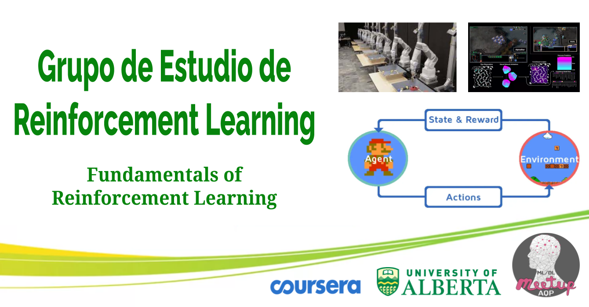

# Grupo de Estudio de Reinforcement Learning

   

Grupo de estudio enfocado en los cursos de la especialización de [Reinforcement Learning](https://www.coursera.org/specializations/reinforcement-learning) ofrecidos por la universidad de alberta y coursera.

## ¿Cuál es la dinámica del grupo de estudio?

Nos reunimos semanalmente abarcando temas específicos, revisando el material disponible en el curso con anticipación. El día de la reunión, uno de los integrantes hará una presentación del tema correspondiente y se resolverán las dudas que hayan al respecto. Los demás integrantes pueden aportar con temas adicionales, entablar discusión y voluntariarse para la presentación en futuras reuniones. Algunas semanas estarán basadas en presentaciones teóricas y otras en prácticas, dependiendo de las tareas o ejercicios del curso.

## Course 1: Fundamentals of Reinforcement Learning

En este curso presenta los [fundamentos de reinforcement learning](https://www.coursera.org/learn/fundamentals-of-reinforcement-learning). Aprenderemos a formalizar problemas de procesos de decisión de Markov. Comprenderemos los métodos básicos del tradeoff exploración/explotación, asi como funciones de valor. En la parte práctica aplicaremos programación dinámica para un problema de control industrial.

### Week 1: Introduction and the K-Armed Bandit Problem

Tema  | Slides | Video
-----| :-: | :-: |
Introduction and the K-armed bandit problem |  | 

Assignment  | Notebook |
------|:-:|
Bandits and Exploration/Exploitation | 

### Week 2: Markov Decision Processes

Tema  | Slides | Video
-----| :-: | :-: |
Markov Decision Processes |  | 

#### Enlaces Útiles

Referencia  | Enlace
-----| :-: |
Reinforcement Learning an Introduction - Capítulo 3|  
Curso CS234 - Lecture 2 | 
Curso CS221 - Lecture 7 | 
Curso de David Silver - Lecture 2 | 
Curso de DeepMind - Lecture 3 | 

### Week 3: Value Functions & Bellman Equations 

### Week 4: Dynamic Programming

## Referencias

1. Libro: [Reinforcement Learning: An Introduction](http://incompleteideas.net/book/the-book-2nd.html).
2. Curso: [CS234-Reinforcement Learning](http://web.stanford.edu/class/cs234/index.html).
____
Únete a nuestra comunidad: 

- Facebook: https://www.facebook.com/MLDLMeetupAQP/
- Slack: https://bit.ly/2uoRQKS
